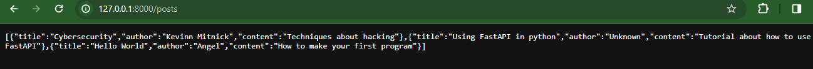

# Ejemplo de API usando FastAPI

Esta es un ejemplo de API utilizando FastAPI.
La con esta API puedes hacer peticiones y recibir los datos
que contiene este.
Cuando busca en geneal la API esta brinda un mensaje de bienvenida.

Al hacer la peticion para ver los datos, estos son mostrados al instante.

Y si se busca cualquier otra cosa nos marca un error
